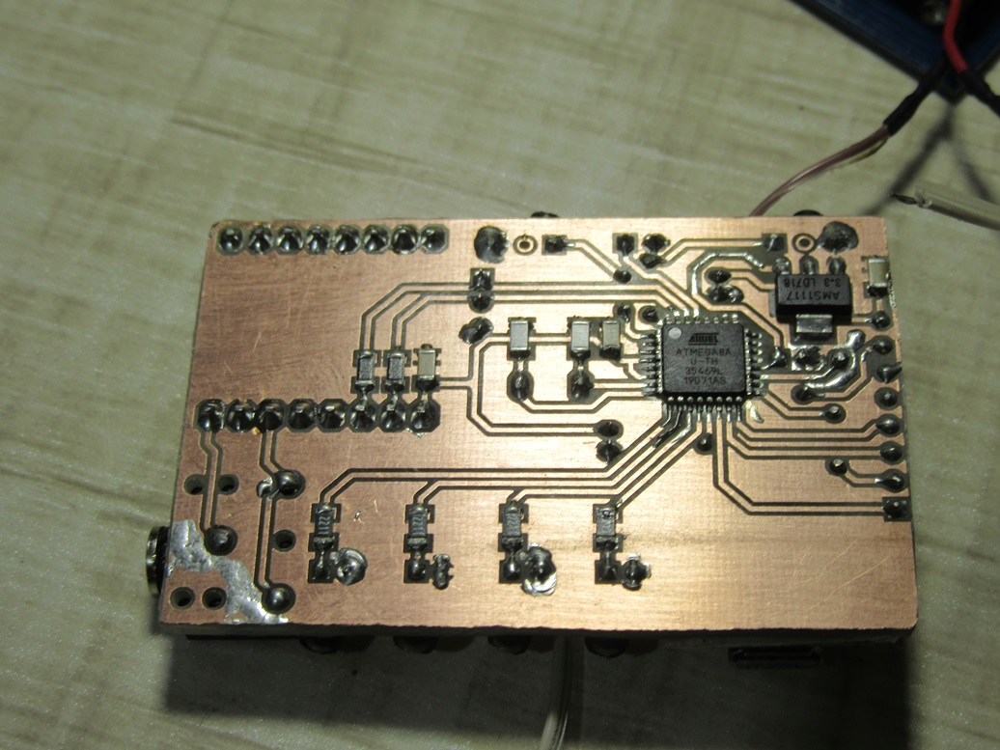
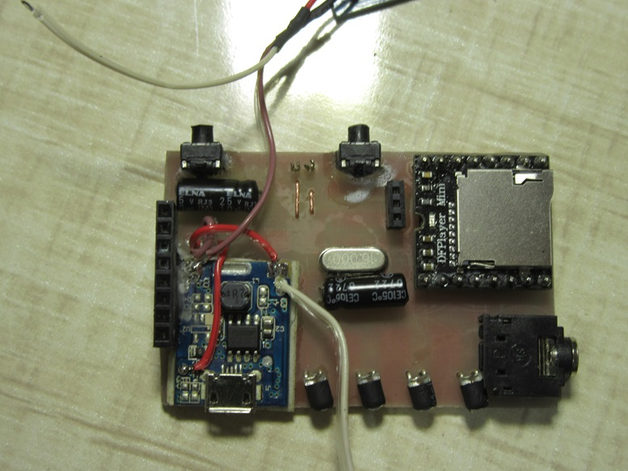
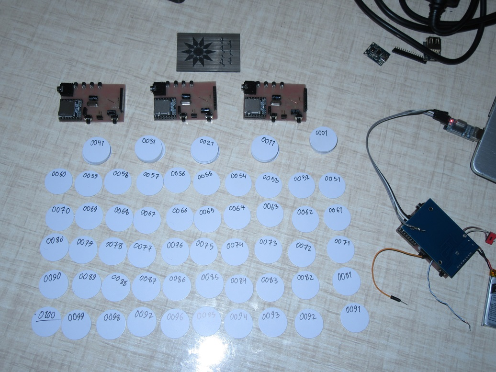
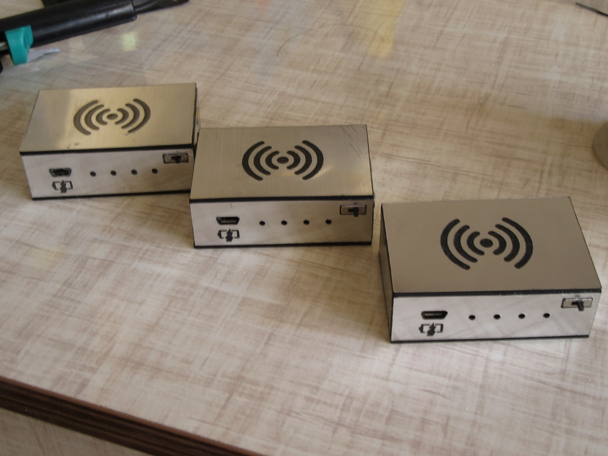
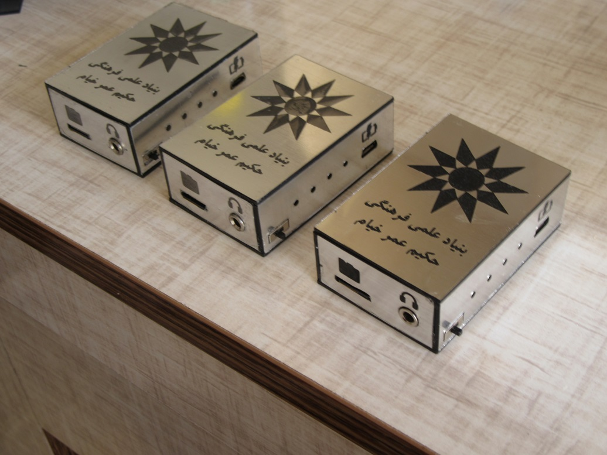

# Museum Audio Guide

This project is an RFID-based audio guide system designed for museums or exhibitions. It allows visitors to scan RFID tags at various exhibits to trigger audio descriptions played through a headset or speaker.

## Project Structure

The repository is organized into the following components:

- **Arduino Code/**: Contains the firmware for the microcontroller.
    - **Final/**: The complete, deployed version of the code (`Final.ino`) handling RFID reading and audio playback.
    - **Test/**: Code snippets for testing individual modules (RFID reader, MP3 player).
    - **read/** & **write/**: Utilities for configuring or reading the RFID tags.

- **PCB/**:
    - **RFID_PLAYER.PrjPcb**: Altium Designer project file.
    - **RFID_PLAYER.PcbDoc**: Custom PCB layout integrating the Arduino, RFID module, and MP3 decoder.

- **Mechanical Design/**: Enclosure designs for the handheld unit.
- **Media/**: Images and visual documentation.

## Features

- **RFID Interaction**: Uses an MFRC522 or similar RFID reader to detect specific tags associated with exhibits.
- **Audio Playback**: Interfaces with a DFPlayer Mini (or similar serial MP3 module) to play audio files corresponding to the scanned tag ID.
- **User Interface**: Simple operation—scan a tag to start playing.
- **Portable**: Designed to be battery-powered for visitor mobility.

## Usage

1. **Hardware Setup**:
   - Fabricate the PCB using the files in the `PCB/` folder.
   - Solder components: Arduino (likely Pro Mini/Nano), RFID Reader, MP3 Module, Battery holder, and Headphone jack.
2. **Content Preparation**:
   - Load MP3 files onto a microSD card.
   - Name files according to the logic in `Final.ino` (e.g., `001.mp3` corresponds to Tag ID X).
   - Insert the SD card into the player module.
3. **Firmware**:
   - Open `Arduino Code/Final/Final.ino` in Arduino IDE.
   - Install required libraries (MFRC522, SoftwareSerial, DFPlayerMini).
   - Upload to the Arduino board.
4. **Operation**:
   - Power on the device.
   - Place an RFID tag near the reader area.
   - The corresponding audio track will play automatically.

## Gallery

